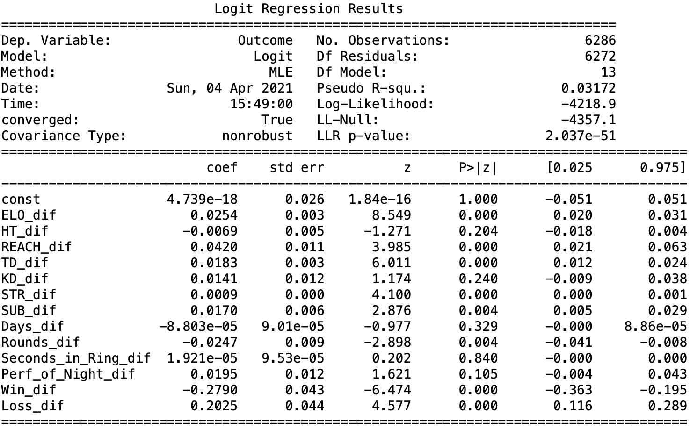

# UFC--Ready-to-Rumble
Scraping and analysing UFC data to see what actually matters when two people clash inside and go to war.

## Introduction

Unfortunately, I am a small man. As a result, in physical confrontations, it is clear that things would not go well. Naturally, my first instinct would be to run as fast as possible in the opposite direction of any would-be attacker, but, I don't run so good, so likely they would catch up with me anyway. Now I'm in the same situation as before, except hot, sweaty, and out of breath. Trust me, no one wants to see that.

As a result, while building up my cardio engine to race away from potential danger, I need an alternative strategy. Also, building such endurance might take a while too since running is basically just slamming your knees into concrete one after the other. Not really my idea of fun. Therefore, I have done some analysis! I have looked into what makes the best fighter in an effort to mold myself into such a presence to terryify opponents and onlookers, scaring them away before battle can even begin. As [Sun Tzu](https://en.wikipedia.org/wiki/Sun_Tzu) once said:

*'The supreme art of war is to subdue the enemy without fighting.'*

Also, it's a nice investigation to see what sort of natural benefits are brought by different body types. We always see Fighters' Reach and Height differences before a fight, but do they really mean anything? Well, it's time to find out. Let's get ready to rumble.

Naturally, a lot of this work will be based on data from the UFC, since they are the biggest and most obvious organisation around. The [UFC](https://www.ufc.com/) is a cage fighting organisation that hosts 1 v 1 matches for either 3 or 5 rounds of 5 minutes each. Winner can be declared by Knock-Out (referee decision), Submission (opponent taps), or Decision (judges scorecards at the end of the match).

## Table of contents
* [Introduction](#introduction)
* [Past Literature](#past-literature)
* [Data Collection and Cleaning](#data-collection-and-cleaning)
* [Data Inspection](#data-inspection)
* [The Reach Advantage](#the-reach-advantage)
* [Styles Make Fights](#styles-make-fights)
* [Issues](#issues)
* [What Actually Matters?](#what-actually-matters)

## Past Literature

There are many different philosphies when it comes to fighting. [Bruce Lee](https://en.wikipedia.org/wiki/Bruce_Lee) often said 'be like water', indicating the necessity of being fluid, adaptable, flexible to anything that is presented to you. From this was born [Jeet Kune Do](https://en.wikipedia.org/wiki/Jeet_Kune_Do), widely considered one of the first attempts at mixing the martial arts. [Conor McGregor](https://en.wikipedia.org/wiki/Conor_McGregor) further emphasised this movement focussed aspect of fighting, even hiring his own movement coach, [Ido Portal](https://en.wikipedia.org/wiki/The_Ido_Portal_Method). There are [interviews](https://www.youtube.com/watch?v=eATllx9jdRM) with McGregor belittling (no surprise there) larger fighters being ['stiff as a board'](https://www.youtube.com/watch?v=sFkoF0IzXeg) and 'addicting to strength and conditioning'. Here a fighter must be nimble and have control over his movements. This echoes a man many consider [the greatest ever](https://en.wikipedia.org/wiki/Muhammad_Ali).

*'Float like a butterfly, sting like a bee'*

A classic counter to this is simply to get more jacked. Pack on the muscle and build the appearance of someone who fights mountains for a living and crushes rocks with his biceps on 'chill' Sunday morning. This is definitely one way to go, and looking at [Francis Ngannou](https://en.wikipedia.org/wiki/Francis_Ngannou), the current heavyweight world champion, this might not be a bad idea. [Here is a video](https://www.youtube.com/watch?v=K76etdV24-Q) of him lifting Shaq in case you needed a bit more evidence than just looking at his Greek God Bod. However, this would come with immediate backlash, we need only go back to [Isreal Adesanya's](https://en.wikipedia.org/wiki/Israel_Adesanya) fight against [Paulo Costa](https://en.wikipedia.org/wiki/Paulo_Costa_(fighter)), another Greek God bodybuilder turned MMA Fighter. Before the fight Adesanya constantly referenced the importance of [technique over muscles](https://talksport.com/sport/mma/768538/israel-adesanya-paulo-costa-hump-ufc-253-ko/). The outcome speaks for itself, 2nd Round KO and a win for Adesanya.

Clearly there is some debate here and no one really knows what the 'ultimate' fighter would look like. Therefore, this will be an investigation into exactly that, and what the statistics say about what really matters in the fight game.

One of the first things that you come across when looking at fighters are stats about their physique. More specifically, their Reach and Height. It is natural for one to think that the further a person's reach is the better. They can hit you and you can't touch them. However, [Chael Sonnen](https://en.wikipedia.org/wiki/Chael_Sonnen), former UFC fighter and general authority on all things fighting, has often said that reach and distance only matters when you know how to use it and the only fighters who know how to use it are [Jon Jones and Isreal Adesanya](https://youtu.be/62hQxjIutmA?t=120). This would indicate that in the vast majority of settings, Reach really doesn't matter, and any advantage gained would be offset but being the same weight (fighters have the same weight limit, so a smaller fighter can have more additional muscle in excess of normal and still come in at a legal weight). This is one of the first things that we will investigate.

Further to this, a common adage in fighting is that ['styles make fights'](styles make fights clothing). There are a multitude of different styles that a fighter can take on. In boxing alone you can fight Ortodox, Southpaw, or even a mix of the two. On top of this, in the UFC, fighters come from all sorts of backgrounds, Wrestling, Muay Thai, Jiu Jitsu. So what really is the best one to go for? This is what the [UFC](https://en.wikipedia.org/wiki/UFC_1) was initially set up to answer, collecting the crème de la crème from a variety of disciplines and squaring them off. After a night of intense action and ferocious competition it was concluded, Jiu Jitsu is the best of the best. So....problem solved, let's go home. Well not so fast. As the wise leader of the fight people, Chael Sonnen, [says](https://www.youtube.com/watch?v=WR_vt2ftIGQ), that's a thing of the past. Fighters nowadays are skilled in all aspects, it's no longer good enough to come in as a striking specialist or a one trick pony grappler. Even the man many say is the greatest of all time, [Khabib Nurmagomedov](https://en.wikipedia.org/wiki/Khabib_Nurmagomedov), renowned for his unparalelled wrestling skills, is still a master striker, who can forget [that](https://www.youtube.com/watch?v=8ftcIKvL4Ic) overhand right, cracking McGregor at his own game. Given this, it results in an interesting question, is there really one sport that beats out the others, or are jack-of-all-trades the real kings?

## Data Collection and Cleaning

The data for this work was taken from the [UFC Website](http://ufcstats.com/event-details/6597b611f1c32555) containing all of the fights up to the end of 2020 (mainly because a lot of this was done over my Christmas holidays). We have further combined this with individual fighter data for features such as Weight and Height. This was collected again from the UFC Website, but this time from the [individual fighters database](http://ufcstats.com/statistics/fighters). Having data all in one place and easily collectible was very useful and the main reason why data from other organisations, such as [Bellator](http://www.bellator.com) was not included. This could be something to do in the future to further improve the analysis performed. Overall, the UFC is seen as the most competitive and elite fighting organisation in the world, with the UFC Champions often considered as the best in the business. Given this, I am comfortable that the sample data that I have collected is representative of professional fighters. They are considered the best in the world and there is no clear sampling bias, for example if the UFC only recruited knock-out artists. They want those who win, regardless of how they do so.

That last line sounded cool, however, it might not be wholly true. [Dana White's Contender Series](https://en.wikipedia.org/wiki/Dana_White%27s_Contender_Series) is a competition where unsigned fighters would compete to impress UFC President, [Dana White](https://en.wikipedia.org/wiki/Dana_White). Naturally, a spectacular one punch finish is often more impressive than a five round grinding chess match. As a result, those getting contracts in this manner are more likely to come from a striking heavy background, holding sufficient power to knock out opponents quickly and easily. However, this is not the only method of gaining a contract and generally we see the best fighters with the best records rising up over time and being signed. Evidence for this would be the master grappler who drags you down and smashes you into submission, Khabib. He may not be flashy with walk-off KOs, but that didn't stop him being ranked **#1** on the [Pound-for-Pound list](https://www.ufc.com/rankings) until the day he retired (aka the best there is).

To get this data in a workable form, I applied various transformations. This would allow me to extract as much information as possible, allowing us to gain insight into what goes into being the best fighter. One of the first things that I did was create a an [ELO ranking](https://en.wikipedia.org/wiki/Elo_rating_system) for athletes. This would help to encorporate more information about fighters' past performances into our analysis beyond just a static record of wins, losses, and draws. This would give a sense of the level of past opponents and the subsequent outcomes. This was done in the standard way, increasing the winner's score and decreasing the losers. However, a potential expansion on this idea would be to look at a potential penalty for number of fights. Unlike traditional sports, fighters often leave matches worse than when they starts. This is due to the damage that is suffered when competing. As a result a win in your 5th fight might be worth more in terms of experience compared to a win in your 40th fight, where you are taking damage on an already battered body.

Building on this, an additional set of features that might be useful in analysing fighters would be how they have performed in the past. However, we are not talking about their outputs of winning or losing, but rather their inputs. How many kicks they threw, how many punches they swung, and even takedowns attempts. We do this in a similar way to constructing the ELO, with a dictionary of fighters initially starting at 0, adding to this after each fight. Then we compute a new score based on that fight's information and storing this updated number in the dictionary for the fighter's next battle. This will help us to look at how a fighter likes to fight. We do not have information on their main style of fighting (wrestler, grappler, striker etc.) so we will use this as a proxy.

An idea that recently came to mind as a result of both [Chael Sonnen](https://www.youtube.com/watch?v=bZ3RcJbu3Bg) and [Joe Rogan](https://en.wikipedia.org/wiki/Joe_Rogan) talking about McGregor [not fighting in a year](https://www.youtube.com/watch?v=hKIlZWBT6j8) causing his latest defeat, was to look into optimal recovery times and how this decends into 'ring rust'. We have added a feature that looks at days spent between fights. Including this into regressions and individual feature analysis will help us to determine if being out of the ring for a whole year really was a cause of McGregor's [recent defeat](https://www.bbc.co.uk/sport/mixed-martial-arts/55770669) to [Dustin Poirier](https://en.wikipedia.org/wiki/Dustin_Poirier). We anticipate that this will be a quadratic relationship as some recovery is good (fighting two fights in a row is probably a bad idea unless you are called [Khazmat](https://en.wikipedia.org/wiki/Khamzat_Chimaev)), but this would then change to a negative as you lose a feel for the fight and all the pressure and emotions that comes with it.

All of these features were added and then a difference was taken between the fighter and their opponent. This differences helps to put the statistics into perspective for the individual fights, rather than comparing absolute figures. An expansion of this idea could be to normalize each of the figures by the number of fights, giving stats per fight. This would reduce the bias for a fight who has had more fights, such as [Donald Cerrone](https://en.wikipedia.org/wiki/Donald_Cerrone) compared to someone newer. The number of past fights can also be included to remove any variation in results that this might cause.

## Data Inspection

#### Variables

Loading in the data, there is a variety of different variables that need explaining. A classic table looks good enough for this job. Here we have summaried what variables we have after the cleaning and manipulation above. We will not use all of these variables, so some will be dropped. However, better to start with a lot and narrow down than take it all away and be left with too little. There's probably some sort of motivational quote in there, unfortunately all I can think of is a quote about me adding too much milk when baking with my mum.

Variable | Description | Calculation | Why? 
---------|-------------|-------------|------
average_odds_F | Average Odds for the Fighter prior to the fight. | Odds averaged from available data | This will help to capture some of the additional unobserved factors that are not contained within standard statistics.
average_odds_O | Average Odds for the Opponent prior to the fight. | Odds averaged from available data | This will help to capture some of the additional unobserved factors that are not contained within standard statistics.
past_W_%_F | The Fighter's past win percentage | Fights won / Total fights | This gives information around past performance that should give an indication of how they will perform in the future.
past_L_%_F | The Fighter's past loss percentage | Fights lost / Total fights | This gives information around past performance that should give an indication of how they will perform in the future.
past_W_%_O | The Opponent's past win percentage | Fights won / Total fights | This gives information around past performance of the opponent that should give an indication of how they will perform in the future, in particular, against the current fighter.
past_L_%_O | The Opponent's past loss percentage | Fights lost / Total fights | This gives information around past performance of the opponent that should give an indication of how they will perform in the future, in particular, against the current fighter.
past_ROUND_F | Number of rounds the Fighter has fought in their career | - | This will help to give an indication of the type of fighter e.g. Knock-Out artist. The lower this is, paired with a good 'past_W_%', we would expect to be a positive indicator for future performance. Further, the higher this figure, the more damage a fighter is likely to have sustained in their career, resulting in a negative effect on future performance. However, an argument could be made that the greater this figure the better as the fighter is more experienced having had more rounds, and so will perform better.
past_ROUND_O | Number of rounds the Opponent has fought in their career | - | This will help to give an indication of the type of fighter e.g. Knock-Out artist. The lower this is, paired with a good 'past_W_%', we would expect to be a positive indicator for future performance. Further, the higher this figure, the more damage a fighter is likely to have sustained in their career, resulting in a negative effect on future performance. However, an argument could be made that the greater this figure the better as the fighter is more experienced having had more rounds, and so will perform better.
past_PERF_F | Number of past Performance of the Night Bonuses earned by the Fighter | - | The more Performance of the Night bonuses earned by the fighter should give an indication that they are a better fighter. This is a subjective measure, however, like the 'average_odds' this might help to capture unobserved abilities of fighters.
past_PERF_O | Number of past Performance of the Night Bonuses earned by the Opponent | - | The more Performance of the Night bonuses earned by the fighter should give an indication that they are a better fighter. This is a subjective measure, however, like the 'average_odds' this might help to capture unobserved abilities of fighters.
past_SECONDS_F | Total seconds that the Fighter has fought in their career | - | This will help to give an indication of the type of fighter e.g. Knock-Out artist. The lower this is, paired with a good 'past_W_%', we would expect to be a positive indicator for future performance. Further, the higher this figure, the more damage a fighter is likely to have sustained in their career, resulting in a negative effect on future performance. However, an argument could be made that the greater this figure the better as the fighter is more experienced having had more rounds, and so will perform better. This can act as a more detailed version of the 'past_ROUND' variable.
past_SECONDS_O | Total seconds that the Opponent has fought in their career | - | This will help to give an indication of the type of fighter e.g. Knock-Out artist. The lower this is, paired with a good 'past_W_%', we would expect to be a positive indicator for future performance. Further, the higher this figure, the more damage a fighter is likely to have sustained in their career, resulting in a negative effect on future performance. However, an argument could be made that the greater this figure the better as the fighter is more experienced having had more rounds, and so will perform better. This can act as a more detailed version of the 'past_ROUND' variable.
days_since_last _fight_F | Total days since the Fighter's previous fight | - | This will help to see how recovery impacts performance as well as investigating if 'Ring Rust' is a real concept and visible in the data. It is expected that this variable will have a quadratic relationship as some recovery helps, but too long not fighting would have a negative impact.
days_since_last _fight_O | Total days since the Opponent's previous fight | - | This will help to see how recovery impacts performance as well as investigating if 'Ring Rust' is a real concept and visible in the data. It is expected that this variable will have a quadratic relationship as some recovery helps, but too long not fighting would have a negative impact.
Outcome | Whether the Fighter won or lost the fight (1 or 0 respectively) | - | This will be the main dependent variable in our investigations.
TD_dif | The difference in the number of past Takedowns between the Fighter and the Opponent | - | This will be useful when determining the type of fighter (striker or grappler) and investigating the impact of this on a fight.
KD_dif | The difference in the number of past Knock Downs between the Fighter and the Opponent | - | This will be useful when determining the type of fighter (striker or grappler) and investigating the impact of this on a fight.
SUB_dif | The difference in the number of past Submissions between the Fighter and the Opponent | - | This will be useful when determining the type of fighter (striker or grappler) and investigating the impact of this on a fight.
WT_dif | The difference in Weight between the Fighter and the Opponent | - | This should be zero for most fights as fighters are limited to different weight classes. However, it might be useful to look at how this difference affects performance in Heavyweight fights were the limit is much larger and some fighters don't even cut any weight before fights.
HT_dif | The difference in Height between the Fighter and the Opponent | - | This is one of the main statistics that is displayed before fights and so this would lead us to believe that it should be important in determining a fight's outcome. This will be looked into further as part of our analysis. It is worth noting that the Height variable is likely to be correlated to the Reach variable as taller individuals tend to have longer reaches. Therefore, to reduce multicollinearity in any regressions that we run, one of these variables will likely be removed.
REACH_dif | The difference in Reach between the Fighter and the Opponent | - | This is one of the main statistics that is displayed before fights and so this would lead us to believe that it should be important in determining a fight's outcome. This makes sense as a longer reach means a fighter can hit their opponent without bieng in range for themselves to be hit. It is worth noting that the Reach variable is likely to be correlated to the Height variable as taller individuals tend to have longer reaches. Therefore, to reduce multicollinearity in any regressions that we run, one of these variables will likely be removed.
ELO_dif | The difference in ELO Ratings between the Fighter and the Opponent | - | The ELO was calculated using the [standard formula](https://en.wikipedia.org/wiki/Elo_rating_system#Performance_rating) that we borrowed from chess. There is scope to adjust this and make it better, for example adding a penatly the more fights and individual has to account for accumulated damaged. However, in reality this might work in reverse where more fights is a better thing to account for more experience. Definitely something to be investigated further.
Days_dif | The difference in the number of days since the last fight | days_since_last_fight_F - days_since_last_fight_O | See above rationale for 'days_since_last_fight' variables.
Rounds_dif | The difference in the number of rounds fought in the Fighter's career vs. their Opponent | past_ROUND_F - past_ROUND_O | See above rationale for 'past_ROUND' variables.
Perf_of_Night_dif | The difference in the number of Performance of the Night bonuses between the Fighter and their Opponent | past_PERF_F - past_PERF_O | See above rationale for 'past_PERF' variables.
Seconds_in_Ring_dif | The difference in the number of seconds fought in the Fighter's career vs. their Opponent | past_SECONDS_F - past_SECONDS_O | See above rationale for 'past_SECONDS' variables.
Win_dif | The difference in the number of wins between the Fighter and their Opponent | - | The more wins a fighter has in the career should indicate that they are a good performer as they have demonstrated this in prevoius matches. This is likely correlated with 'past_W_%' and 'ELO_dif' variables as they both come from the past win record of the Fighter and Opponent. Therefore, some of these will likely need to be removed prior to running Regressions to avoid multicollinearity.
Loss_dif | The difference in the number of losses between the Fighter and their Opponent | - | The more losses a fighter has in the career should indicate that they are a poor performer as they have demonstrated this in prevoius matches. This is likely correlated with 'past_L_%' and 'ELO_dif' variables as they both come from the past loss record of the Fighter and Opponent. Therefore, some of these will likely need to be removed prior to running Regressions to avoid multicollinearity.
TD_per_min | The average number of Takedowns per minute in the Fighter's career | Number of Takedowns in their career and the total time spent in the ring | See above rationale for 'TD_dif' variables.
KD_per_min | The average number of Knockdowns per minute in the Fighter's career | Number of Knockdowns in their career and the total time spent in the ring | See above rationale for 'KD_dif' variables.
SUB_per_min | The average number of Submissions per minute in the Fighter's career | Number of Submissions in their career and the total time spent in the ring | See above rationale for 'SUB_dif' variables.
STR_per_min | The average number of Strikes per minute in the Fighter's career | Number of Strikes in their career and the total time spent in the ring | See above rationale for 'STR_dif' variables.

#### Everyone's Favourite - Summary Statistics

While we have some initial hypotheses laid out in the review of past literature, it will be good to just take a general look at the data to get a feel of what is going on there. Therefore, first, as always, some summary statistics.

After some cleaning, we are left with 3143 total fights. This isn't too bad, still a lot. However, this is data for 1335 fighters i.e. less than three fights per person. The main problem with this is that obtaining information around the unobservables of each fighter will be difficult. There is a lot that goes into the outcome of a fight, beyond what is in this dataset. Commentators often talk about 'grit', 'determination', and 'heart' as things that push fighters beyond what they though possible. These are things that are highly unlikely to be captured here. On the otherhand, the brightest minds in the world can't yet quantify 'grit', pretty confident my small brain wouldn't be able to either, even with all the data in the world. Another area this will hit is fight predictions again as these unobservables are unlikely to be appropriately measured. This dataset is small compared tothe universe of MMA fights because we reduced fights down to only those where we have betting odds data (since this is pretty much the best predictor we have and may well capture some of these unobservables I was so devastated by only moments ago, huzzah!).

Looking at the number of fights over time, we see that this has steadily grown since the mid-2000s, which is to be expected as the UFC has become increasingly popular and MMA and increasingly mainstream sport. We see events levelling off from 2015 onwards, however, this is more due to consequences of cleaning and this number has in reality has been growing steadily. Except, of course, in 2020 when a stupid virus went round that basically shutdown the world. Classic.

#### Correlation Matrix

Before jumping into analysis like some overexcited rat lunging for cheese before a cold metal bar comes smashing down on its neck, it will be first useful to see how all of these variables interact with each other. What seems to be linked with what? To do this, we will use our trusty correlation matrix. This will help to better understand our data and the connections between variables, as well as give an indication of potential causes of multicollinearity later down the line.

*Plotting the correlation matrix*
~~~
fig = plt.figure(figsize=(16,9))
sns.heatmap(data.corr(), annot=False, linewidths = 1, cmap="coolwarm", linecolor="k")
~~~

The main thing that stands out is the large red section in the top left of the plot. These are all of the 'past' variables. All being correlated makes sense since Rounds and Seconds are calculated from the same underlying metrics and the more fights a Fighter has, the more likely they are to win Performance of the Night bonuses. Additionally, this last link works in reverse with more Performance of the Night bonuses leading to more appearances as you have likely performed well to earn the extra credit. Similar reasoning can be used to explain the correlation in the corresponding difference metrics.

What was more surprising intially was the correlation between the fighting metrics, like Knockdowns and Submissions, and the 'past' timing variables. This can be seen in the middle left of the heatmap. However, after some consideration, this too makes sense. Being metrics of events that happen in fights, the more fights a fighter has had, the more punches, kicks, and takedowns a fighter is likely to have made, resulting in some correlation between these variables. Any of the 'past' variables will give an implicit indication of the length of a Fighter's career and so a variable relating to experience might be required to remove variation associated with this before running a regression.

Looking at the correlations with the Outcome variable is a much more stark comparison. We'll start positive though, at least the bookmakers know what they are doing. Then again, that might be a negative thing. Here odds are measured as [American Odds](https://www.investopedia.com/articles/investing/042115/betting-basics-fractional-decimal-american-moneyline-odds.asp#:~:text=Key%20Takeaways-,The%20three%20main%20types%20of%20betting%20odds%20are%20fractional%20(British,difference%20in%20terms%20of%20payouts.)) and as classic Americans, nothing is ever that straightforward. Unlike Fractional or Decimal Odds, here the favourite has negative odds and represents the amount of money you need to stake to win $100...obviously. More details of the various methods of odds are linked since my description is sketchy at best, and at worse, just plain worng. Still, this does represent some ability to precdict the winners of fights, an encouraging sign.

Further, there seems to be some light positive correlation with the past wins of the Fighter and a light negative correlation with the past losses of the Opponent, as we would expect. More wins for yourself and more losses for your opponent should indicate that you will come out on top. Another area of correlation is the difference in the ELO score, which is designed to be an indicator of skill and ranking compared to other fighters. Similar to the win/loss differences, this correlation is minor, but adding them together might still give us some predictive ability.

Going back to our early hypotheses, it doesn't look like there is much correlation between fighting actions, like Takedowns, and Outcome. This indicates that there is not one dominant style that just beats all others, which is expected as we see a range of current champions on the [UFC Roster](https://www.ufc.com/rankings). We will go into more detail however to see if any minor difference might be squeezed out on further anaylsis.

## The Reach Advantage

So, into testing the hypotheses. Up first we have one of the top things that pops up when a fighter's stats are shown, and one of the main things no one I ask has a clue about. Does having a longer reach actually affect a fighter's performance?

To look into this, it will be good to initially look at the distribution of Reach differences split by Outcome.
~~~
sns.distplot(winners['REACH_dif'], label='Winners')
sns.distplot(losers['REACH_dif'], label='Losers')
plt.legend()
~~~

Nice! We have two populations that look almost identical. Fear not though, we can look to see if there is some separation here. For this, we will do a classic hypthosis test, examining if the mean difference in Reach is greater for Winners compared to Losers. Naturally, like most statisticians without an imagination, we will be using a 5% significance level.

Our population is well above 30, so we can use a z-test. If this were not the case, a t-test would be more appropriate to account for the resulting increased uncertainty. Graphically, the difference between these two distributions is that the t-distribution has fatter tails. Further, from the plot above we can see that the data is normally distributed around the mean, which appears to be roughly 0. The one slight issue with this is the lack of independence between samples. This is because sometimes the same fighter is selected twice as they fight multiple times, so long-armed fighters who happen to be really good might be biasing out dataset. However, we have a large number of different fights, so this should't be an issue overall.

For our null hypothesis, we have that there is no difference between the mean Reach difference for Winners and Losers. Or stating another way, that having a longer or shorter reach has no effect on the Outcome of a fight. We will have this as a two tailed test, as while we might expect a longer reach to be better as you can hit without being touched, a smaller reach might acutally be better. A fighter would be more nimble and potentially have greater control over their limbs as they are closer to the body.

H(0): &mu; = 0 

H(1): &mu; ≠ 0

Quickly looking at the average Reach difference, we see that this is 0.2 inches, so mostly fighters line up with the same wingspan. This makes sense since they are in the same weightclass and so would be expected to be of similar height. Moving on to performing the test, we use the following code:

~~~
ztest ,pval = stests.ztest(winners['REACH_dif'], x2 = losers['REACH_dif'], value=0, alternative = 'two-sided')
print(float(pval))

if pval<0.05:
    print("reject null hypothesis")
else:
    print("accept null hypothesis")
~~~

This gives us a p-value of 1.7237261348489579e-06, which to any normal person is 0. Therefore, we reject the null hypthosis and can conclude that Reach does play a difference in fights. Translating this into something useful for myself, always fight people smaller than you. That or stretch myself with one of those medival torture machines. Sweet, onto the next item.

## Styles Make Fights

### So, What's Your Stance?

Discovering Reach has an impact is all well and good, however, that doesn't really give us anything to work on ourselves, or any real direction in becoming the Ultimate Fighter. As much as I hate to admit it, my growing days are behind me. What we need is something more tangible. What stance should we use?

One of the first things that you learn in boxing is which stance you are going to fight in, [Orthodox](https://en.wikipedia.org/wiki/Orthodox_stance), with your left hand leading as your jab hand, or [Southpaw](https://en.wikipedia.org/wiki/Southpaw_stance), with your right hand leading as your jab hand. Generally this is dictated by your dominant hand and you lead with the other. However, recently there has been [debate](https://www.youtube.com/watch?v=96B8_Vfkxmw) over one potentially being more effect than the other. This debate looks like it could use data.

First, let's have a quick look at the overall results from different stances. Is there one clear winner that just always dominates? We will also be able to look at which stance is most popular. Given how this was determined in the past, we would expect Orthodox to be the most popular since most individuals are right handed.

~~~
fig = plt.figure(figsize=(10,5))
sns.countplot(data['Stance_F'], hue = data['Outcome'])
~~~

Sweet, so Orthodox is most popular, as expected. There are also some fighters using a Switch stance, where they change between Orthodox and Southpaw during the fight, see [Klitschko vs. Tyson Fury](https://en.wikipedia.org/wiki/Wladimir_Klitschko_vs._Tyson_Fury) for a great example of this, and some using an Open Stance. Those using an Open Stance is incredibly low, so we will mostly be excluding them from any testing we perform later on. However, it looks like Southpaw and Switch stances are winning more than they are losing...definitely an area for further investigation.

Next we will look at how the stances compare against each other. To do this, we will plot the wins (1) and losses (0) of each stance against all others to see if any match up particularly well against any others.

~~~
fig = plt.figure(figsize=(10,5))

ortodox = data[data['Stance_F'] == 'Orthodox']
sns.countplot(ortodox['Stance_O'], hue = ortodox['Outcome'])
~~~

~~~
fig = plt.figure(figsize=(10,5))

southpaw = data[data['Stance_F'] == 'Southpaw']
sns.countplot(southpaw['Stance_O'], hue = southpaw['Outcome'])
~~~

~~~
fig = plt.figure(figsize=(10,5))

switch = data[data['Stance_F'] == 'Switch']
sns.countplot(switch['Stance_O'], hue = switch['Outcome'])
~~~

The immediate point that stands out to me is that Orthodox seems to do worse against both Southpaw and Switch stances. It also gives a first hint that one might be better than the others. A reason for this could be because Orthodox fighters just aren't as used to fighting Southpaws (and Switch) since they are much less prevelant in the population. Whereas Southpaws get much more practice at battling Othodox. This level of familiarity and experience might just give them the edge.

But just how different is this difference? Is it significant, or could it just be a fluke of the data. To look at this, we will be running another classic hypothesis test. However, we will be doing this one slightly more manually. This is just a good bit of practice to make sure we actually understand what is going on under the hood.

First, we will look at what a random distribution would look like. Here, were have collections of [Bernoulli Trials](https://en.wikipedia.org/wiki/Bernoulli_trial), Successes being Wins and Fails being Losses. As a result, we will us a [Binomial Distribution](https://en.wikipedia.org/wiki/Binomial_distribution) and count the number of Successes. We will run this 100,000 times and see what a random distribution of wins and losses would look like. This will let us simulate what we would expect to see if there was no connection between a fighter's stance and the Outcome of the fight.

~~~
fig = plt.figure(figsize=(10,5))

a = np.random.binomial(100, 0.5, 100000)
sns.countplot(a)
~~~

Here we have ran the simulation over 100 fights for each sample. However, when performing our testing, we will adjsut this to the number of fights that were actually obsereved in each sample.

Next, we will have a look at the number of wins in our populations (comparable to the mean success rate in our simulations) and compare to how often that number or more wins occurred in our 100,000 simulations. This will show us how unlikely the number of wins was if there is no difference between stances.

~~~
southpaw_win_v_orthodox = southpaw[(southpaw['Outcome'] == 1) & (southpaw['Stance_O'] == 'Orthodox')]
southpaw_loss_v_orthodox = southpaw[(southpaw['Outcome'] == 0) & (southpaw['Stance_O'] == 'Orthodox')]
percentage_southpaw_win_v_orthodox = (len(southpaw_win_v_orthodox) / 
                        (len(southpaw_win_v_orthodox) + len(southpaw_loss_v_orthodox)))

print('Southpaw wins vs Othodox', len(southpaw_win_v_orthodox))
print('Southpaw losses vs Othodox', len(southpaw_loss_v_orthodox))
print('Percentage won:', round(percentage_southpaw_win_v_orthodox * 100,2), '%')
~~~

Event | Occurrence
:-----|----
Southpaw wins vs Othodox | 503
Southpaw losses vs Othodox | 453
Percentage won | 52.62 %

~~~
switch_win_v_orthodox = switch[(switch['Outcome'] == 1) & (switch['Stance_O'] == 'Orthodox')]
switch_loss_v_orthodox = switch[(switch['Outcome'] == 0) & (switch['Stance_O'] == 'Orthodox')]

print('Switch wins vs Othodox', len(switch_win_v_orthodox))
print('Switch losses vs Othodox', len(switch_loss_v_orthodox))
print('Percentage won:', round((len(switch_win_v_orthodox) / 
                        (len(switch_win_v_orthodox) + len(switch_loss_v_orthodox))) * 100,2), '%')
~~~
Event | Occurrence
:-----|----
Switch wins vs Othodox | 85
Switch losses vs Othodox | 72
Percentage won | 54.14 %

We can see that Switch wins more frequently against Orthodox compared to Southpaw, however, the number of fights is far lower, giving us less confidence that this isn't just due to random chance. Therefore, next we need to work out which of these is more statistically significant. The plan to do this is to look at which is less likely compared to a standard binomial expansion, with n = number of fights in sub-population and p = 0.5 (i.e. outcome is the same as that of a coin toss).

#### Southpaw vs. Orthodox
~~~
total_southpaw_vs_orthodox = len(southpaw_win_v_orthodox) + len(southpaw_loss_v_orthodox)

binomial_southpaw = np.random.binomial(total_southpaw_vs_orthodox, 0.5, 1000000)
print('Probability of seeing observed result:', 
      round((sum(binomial_southpaw >= len(southpaw_win_v_orthodox)) / len(binomial_southpaw)) * 100, 3), '%')
~~~
Probability of seeing observed result: **5.694 %**

#### Switch vs. Orthodox
~~~
total_switch_vs_orthodox = len(switch_win_v_orthodox) + len(switch_loss_v_orthodox)

binomial_switch = np.random.binomial(total_switch_vs_orthodox, 0.5, 1000000)
print('Probability of seeing observed result:', 
      round((sum(binomial_switch >= len(switch_win_v_orthodox)) / len(binomial_switch)) * 100, 3), '%')
~~~
Probability of seeing observed result: **16.972 %**

Painful, neither results are significant at the 5% level. However, we do see that the probably is some advantages in going for different stances to Orthodox. This is likely down to lack of experience against these less popular positionings. It would be interesting to see how this breaks down between left- and right-handed individuals since that was previously the main method for determining which hand you lead with. Was there actually reason to this, or would right-handers actually benefit from leading with their more dominant and more frequently used right hand? Definitely one area of potential follow-up.

### Ground and Pound or Knock-Out Artist?
There is no direct feature to say if someone is mainly a striker or a grappler, or even a combination between the two. However, it would be reasonable to assume that strikers would tend to have more finishes on their feet (more KDs and more STRs) and grapplers would have more finishes on the ground (SUBs and TDs). Therefore, a decent proxy might be to compare how fighters with more grappler heavy stats do against fighters with more striking heavy stats. This could give us insight into which style is better.

One potential downfall of this is that fighters nowadays aren't trained in a specific discipline, and so the populations that we are comparing might not represent what how world-class boxers would really do against world-class wrestlers. Getting data on this would be really beneficial for future analysis.

We can group based on a couple of different columns. Either, the method of finish, or the total number of past actions (strikes, takedowns, submissions, knockdowns). Since I have few friends and little better to do while in lockdown, will look at both. First up, past actions. This is what the fighter actually does most, compared to just how the match was finished, hence it might give us a better indication of their overall fighting style. Also, there is a smaller sample size when looking at the method of finish as it only gives detail on the winner, cutting the population in half. A potential expansion to this could be to add the method of loss to bridge this gap. We could then use this to indicate where a fighter is more uncomfortable and so their preferred style might be the opposite. Case and point, until recently Conor Mcgregor had never been knocked out, but submitteed multiple times, as such we would classify him as a striker. Given he had a [brief spell](https://en.wikipedia.org/wiki/Floyd_Mayweather_Jr._vs._Conor_McGregor) in boxing against [Floyd Mayweather](https://en.wikipedia.org/wiki/Floyd_Mayweather_Jr.), this might be pretty accurate.

So problem numero uno, when we split fighters into strikers and grapplers based on *total* KDs and STRs vs total TDs and SUBs, strikes simply happen more often than grappling maneuvers. This is somewhat expect though since a submission usually finishes the fight and a takedown is very rare. Therefore, grouping based on totals will not work.

There are a couple of ways to solve this, look at comparisons to the average perhaps, e.g. if a fighter is below average in STR and above in TD, they are likley a wrestler. However, this could get complicated if a fighter is above average in everything as would be the case for long-standing fighters. Just having more fights will increase your numbers. **(Method A)**

Another way would be to look the total proportion of STR, KD, TD, and SUBs for the whole dataset and then base the split off how each fighters stats compare to this. This can be quite complicated in terms of data manipulation, but fixes the issues of one fighter having more fights because it will always be out of 100%. **(Method B)**

A final method would be to normalising the values, so that they are comparable. Another way of putting this would be to get the values all working on the same scale so a one unit increase in STR is comparable to a one unit increase in TD. **(Method C)**

We will attempt Methods B and C, mainly to practice data manipulation, and secondly to compare which might give a better split of the population. Initially I think that Method C would be best.

~~~
data_types_of_fighter = data_types_of_fighter_full[['STR_F', 'TD_F', 'KD_F', 'SUB_F']]
data_types_of_fighter.dropna(inplace = True)

for col in data_types_of_fighter.columns:
    data_types_of_fighter[col] = data_types_of_fighter[col].apply(lambda x: str(x))
    data_types_of_fighter[col] = data_types_of_fighter[col].apply(lambda x: x.replace('--', '0'))
    data_types_of_fighter[col] = data_types_of_fighter[col].apply(lambda x: float(x))
    
data_proportions = data_types_of_fighter.sum()
data_proportions
types = ['STR', 'TD', 'KD', 'SUB']
proportions = {}
for i in range(0, len(types)):
    proportions[types[i]] = ((data_proportions[i]) / (data_proportions.sum()))
    
~~~

Action | Proportion
-------|-----------
STR | 0.944
TD | 0.034
KD | 0.008
SUB | 0.013
 
Oh dear, another problem. STR are so dominant and even include strikes on the ground. Therefore, it might make sense to eliminate them, and just look at how the fight got to the ground, TDs vs KDs.

~~~
data_proportions = data_types_of_fighter.sum()
data_proportions = data_proportions[1:-1]
types = ['TD', 'KD']
proportions = {}
for i in range(0, len(types)):
    proportions[types[i]] = ((data_proportions[i]) / (data_proportions.sum()))
~~~

Action | Proportion
-------|-----------
TD | 0.799
KD | 0.201

Ah that's a bit better.

~~~
key_columns = ['KD_F', 'TD_F']
for col in key_columns:
    data_types_of_fighter_full[col] = data_types_of_fighter_full[col].apply(lambda x: str(x))
    data_types_of_fighter_full[col] = data_types_of_fighter_full[col].apply(lambda x: x.replace('--', '0'))
    data_types_of_fighter_full[col] = data_types_of_fighter_full[col].apply(lambda x: float(x))

data_fighters_group = data_types_of_fighter_full.groupby('Fighter')
data_fighters_group_trim = data_fighters_group[['TD_F', 'KD_F']].sum()

data_fighters_group_trim['TD_F_Percent'] = (data_fighters_group_trim['TD_F'] /
                                            (data_fighters_group_trim['TD_F'] + data_fighters_group_trim['KD_F']))
data_fighters_group_trim.dropna(inplace = True)

data_fighters_group_trim['Type'] = np.where(data_fighters_group_trim['TD_F_Percent'] >= proportions['TD'],
                                           'Grappler',
                                           'Striker')
                                        
data_fighters_group_trim['Type_O'] = data_fighters_group_trim['Type']

data_types_of_fighter_final = pd.merge(left = data_types_of_fighter_full, right = data_fighters_group_trim['Type'],
                                        on = 'Fighter', how = 'left')
data_types_of_fighter_final = pd.merge(left = data_types_of_fighter_final,
                                       right = data_fighters_group_trim[['Type_O']],
                                       left_on = 'Opponent', right_on = 'Fighter', how = 'left')

strikers = data_types_of_fighter_final[data_types_of_fighter_final['Type'] == 'Striker']
grapplers = data_types_of_fighter_final[data_types_of_fighter_final['Type'] == 'Grappler']
~~~

#### How do strikers do?

~~~
fig = plt.figure(figsize=(10,5))
sns.countplot(strikers['Type_O'], hue = strikers['Outcome'])
~~~

#### How do grapplers do?

~~~
plt.figure(figsize=(10,5))
sns.countplot(grapplers['Type_O'], hue = grapplers['Outcome'])
~~~

So it looks like strikers do better than grapplers. Won't make old Chael happy. Further, as this is a series of Successes or Failures (Wins or Losses), this can again be modeled as a Bernoulli Trial. We will look to see if this win rate is significantly different to what we would expect if Strikers and Grapplers were perfectly equal (i.e. 50/50 split in wins).

## Issues

With most things in my life, there are a lot of issues that come with this work. For ease we will go in order.

When looking at how Reach affects fights, we are just looking at two different populations, Winners and Losers. We are then comparing the reach differences of these two groups. During this, we don't control for any other variables, we are naively looking at the problem and saying how different is one attribute between populations. This is an issue because this doesn't actually show that having a longer reach will necessarily lead to an increased chance of winning. Maybe a longer reach means a taller fighter and more height actually wins you the fight. It could even be something wild like the referees will actually favour greater wingspans. Obviously this is quite unlikely, however, based on the work above, we are not able to effectively disprove this. A nice fix would be to use a linear regression to look at effects, conditioning on numerous other variabels. This will help in isolating the impact of Reach on the outcome fo the fight and bring us more evidence of whether or not it should be taken into account when evaluating athletes.

Moving onto our analysis of different styles, much more issues appear. The most obvious of which, we don't actually have a variable that will tell us what style of fighter an individual is. That would have been really nice to have. Instead we had to use proxies, which might be just as good, but another issues, we don't really have a measure to tell us if they truly are any good. This is quite a large assumption and underpins a lot of our conclusions. Further, there is no way of telling whether that style even won them the fight. A good example of this would be the [Karamu Usman vs. Colby Covington title match](https://en.wikipedia.org/wiki/UFC_245). Both individuals were wrestlers growing up and as such would be primarily ground experts. However, during the fight [not a single takedown attempt was made](http://ufcstats.com/fight-details/82177c0f91d9618a). This fight was entirely fought standing up. Our analysis is not sophisticated enough to cover these kinds of battles and performances. To do this, we would need more detailed individual fight backgrounds and fight details. We could do some work to see how fights are won, using statistics from the UFC that look at the number of key actions in each fight and based on this see which discipline is more effective. Definitely something to consider moving forwards.

## What Actually Matters?

So what actually matters when it comes to a fight. Well we haven't done a regression yet and is an analysis really complete if you haven't run one?  Probably, but we're still going to do one anyway. 

~~~
X = data[['ELO_dif', 'HT_dif', 'REACH_dif', 'TD_dif', 'KD_dif', 'STR_dif', 'SUB_dif',
          'Days_dif', 'Rounds_dif', 'Seconds_in_Ring_dif', 'Perf_of_Night_dif',
          'Win_dif', 'Loss_dif']]
y = data['Outcome']
X2 = sm.add_constant(X)
est = sm.Logit(y, X2)
est2 = est.fit()
print(est2.summary())
~~~

Alright! We can see that one of our initial research areas, Reach comes out as statistically significant, with a p-value less that 0.05, and the marginal effect is positive. As a result, we can reject the null hypothesis that having a longer reach has no impact on the result of a fight. However, what is interesting is that Height is insignificant. Surprising given that the two are closely linked. However, from above work, we know that these variables are highly correlated, and so there is multicollinearity present in the regression. Removing either one of these would be beneficial and it would likely leave the other as a significant variable. It would also increase the accuracy of our uncertainty metrics.

This is also likely to be the story when looking at the Rounds_dif and Seconds_in_Ring_dif variables. One is shown as significant in determining the outcome of the fight, however the other is not. These two are in many ways the same and so one should be removed from the regression to avoid any problems due to multicollinearity.

A final thing to add to the regression would be a squared variable for variables indicating time out of the ring. This would be really useful when looking at how 'ring rust' affects fighters and if it is truly is a real phenomenon or just something fighters say when looking for explainations of a loss.

All of these represent solid potential beginnings for new research projects. Further, we could look at prediction engines to see how well machine learning techniques apply to environments that are highly volatile and random, with a single punch being enough to change an entire fight.
